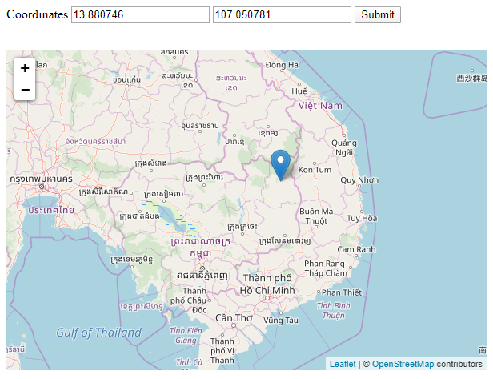
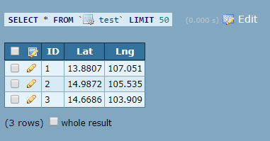

# Không sử dụng Auto Increment trong PHP để update ID

### Idea: 
Đếm số hàng trong database trước khi add thêm dữ liệu. Nếu dữ liệu chưa có hàng nào thì sẽ bắt đầu ID là 1, 
nếu như đã có rồi thì lấy biến đếm số hàng hồi nãy cộng thêm vào

### Ngôn ngữ lập trình sử dụng
PHP, MySQL
Phụ trợ trong web: HTML, CSS, JS
```
$result = mysqli_query($conn, "SELECT * FROM Test");
$row = mysqli_num_rows($result);
	
$query0 = "INSERT INTO Test VALUES(1, '$lat', '$lng')";
$queryNULL = "INSERT INTO Test VALUES(($row + 1), '$lat', '$lng')";

if ($row == 0) {
	mysqli_query($conn, $query0);
} else {
	mysqli_query($conn, $queryNULL);
}
```

### Két quả thu được
+ Nhập vào data

+ Kết quả sau 3 lần nhập

